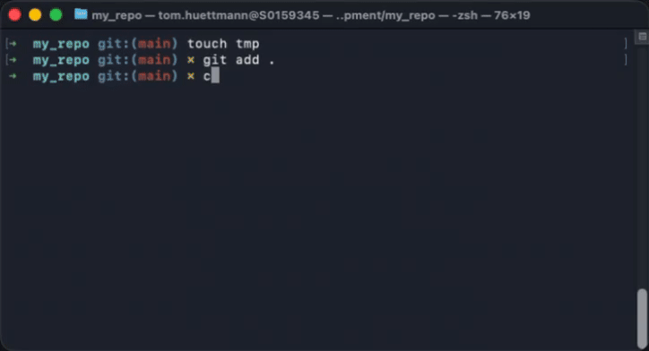

# Co-Author Committer


[](LICENSE)

A Swift-based terminal UI tool for creating git commits with co-authors support.
Quickly search through your repository's contributor history and add them as co-authors to your commits.



## Features

- **Smart Contributor Discovery**: Automatically scans your git history to find contributors
- **Pagination Support**: Load contributors on-demand for large repositories
- **Interactive TUI**: Clean terminal interface built with SwiftTUI
- **Fast & Efficient**: Caches contributor data and filters duplicates
- **Co-Author Support**: Follows the [GitHub co-author convention](https://docs.github.com/en/pull-requests/committing-changes-to-your-project/creating-and-editing-commits/creating-a-commit-with-multiple-authors)

## Installation

### Via Homebrew

```bash
brew tap tomhuettmann/tap
brew install tomhuettmann/tap/ca-committer
```

### From Release

Download the latest release from [GitHub Releases](https://github.com/tomhuettmann/ca-committer/releases):

## Usage

Run in any git repository:

```bash
# Use current directory
cac

# Specify a repository path
cac -d /path/to/repo

# Adjust pagination size (default: 100)
cac -n 200
```

### Options

- `-d, --directory <path>`: Git repository directory (default: current directory)
- `-n, --numberOfCommitsPerPagination <count>`: Number of commits to scan per page (default: 100)
- `--version`: Show version information
- `-h, --help`: Show help information

## Requirements

- macOS 14.0 or later
- Git installed and configured
- A git repository

## How It Works

Co-Author Committer scans your git repository's history to extract contributor information, filters out duplicates, and presents them in an interactive terminal UI. When you commit, it automatically formats co-author trailers following GitHub's convention:

```
Your commit message

Co-authored-by: John Doe <john@example.com>
Co-authored-by: Jane Smith <jane@example.com>
```

## Development

Built with:
- [Swift Argument Parser](https://github.com/apple/swift-argument-parser) - Command-line interface
- [SwiftTUI](https://github.com/rensbreur/SwiftTUI) - Terminal user interface

## Contributing

Contributions are welcome! Please feel free to submit a Pull Request.

## License

This project is licensed under the MIT License - see the [LICENSE](LICENSE) file for details.

## Author

Tom Hüttmann - [@tomhuettmann](https://github.com/tomhuettmann)
